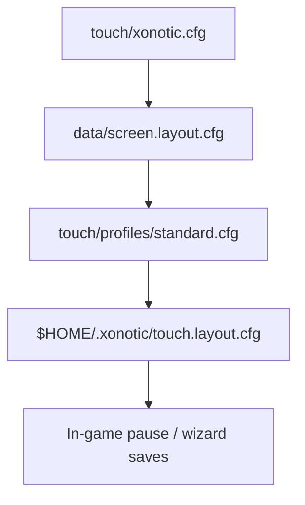
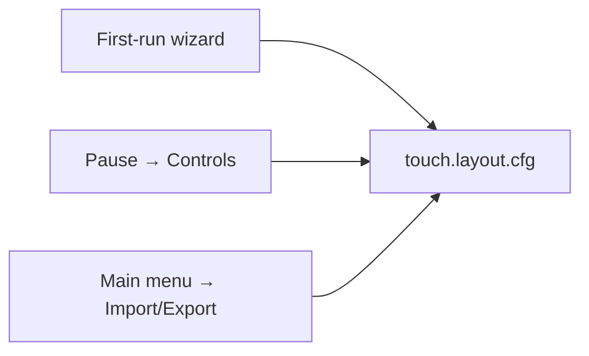

# Touch controls layer

Landscape-first **two-thumb arena** controls for touch-only play on Linux tablets and phones (Flatpak). Ship defaults live in **`touch/xonotic.cfg`** and **`touch/profiles/`**; per-player overrides persist on device. CSQC implementation targets `engine/data/xonotic-data.pk3dir/qcsrc/client/` (see [SOURCES.md](SOURCES.md)).

Related: [SCREEN.md](SCREEN.md) (resolution / DPI), [ARCHITECTURE.md](ARCHITECTURE.md) (repo layout).

---

## Contents

1. [Design goals](#design-goals) · [Default layout](#default-arena-touch-standard-preset)
2. [Config layering](#config-layering) · [Cvar schema](#cvar-schema)
3. [Presets](#preset-bundles-touchprofiles) · [Settings UI](#settings-ui-intent-groups)
4. [Session flow](#session-flow-menus) · [In-game UX](#in-game-ux-beyond-overlay)
5. [Platform / online](#platform) · [Export/import](#export--import)
6. [Implementation map](#implementation-map)

---

## Design goals

| Layer | Answers | User-facing term |
|-------|---------|------------------|
| **Layout** | Where widgets sit on screen | Geometry, customize mode |
| **Feel** | How look / move / fire behave | Sensitivity, smoothing, aim assist |
| **Presets** | One-tap bundles | Standard, Casual, Competitive, … |
| **Performance** | Battery vs quality trade-offs | Battery / Balanced / Quality |

Players pick a **preset first**, then tweak sliders. Layout and feel are separate in the settings UI even when stored in one file.

---

## Default: Arena touch (Standard preset)

Two-thumb layout tuned for Xonotic strafe movement and nine weapons.

```
┌─────────────────────────────────────────────────────────┐
│  ✚ 100 ▬▬▬▬   14:31        [scores]                     │
│  ⛊   5 ▬              MENU     CHAT                     │
│  ▮  28                    [kill feed]      1 ▰          │
│  [chat feed]                               2 ▰          │
│                              RIGHT ~68% = look (drag)   │
│   ╭──────╮                   tap = fire, drag = look    │
│   │ MOVE │                         ╭───────╮            │
│   ╰──────╯                         │ FIRE  │            │
│ (CONSOLE) (SCORE)       (DUCK)   (═══HOP═══)            │
└─────────────────────────────────────────────────────────┘
```

The top band is split into thirds: player state left, match clock centre, scores
right, with MENU and CHAT beneath the scores. CONSOLE and SCORE sit in the
bottom-left — four pills do not fit beside two readouts on a 3:2 panel, so the two
corners split by how often they are used: the top-right holds what a player reaches
for mid-match, the bottom-left what is worth a deliberate reach.

Health, armour and ammo are one group of three rows in the top-left corner, sharing
an icon column and a right-aligned number column. Ammo used to sit out by FIRE, on
the strip of screen the right thumb crosses between FIRE and HOP, where the thumb
covered it. The weapons strip holds the right edge on its own, above FIRE; the kill
feed and the chat feed each get a band that touches neither.

| Zone | Input | Engine / QC binding |
|------|-------|---------------------|
| Left stick | Analog move; floats to the touch-down point | `+forward`, `+back`, `+moveleft`, `+moveright` |
| Right ~68% | Drag = look | Mouse delta → yaw/pitch (`sensitivity`, `m_pitch`, `m_yaw`) |
| Look zone | Short tap = fire | `+attack` for one frame |
| Fire | Hold; sliding off keeps firing and steers | `+attack` (+ look delta) |
| **HOP** | Tap = one jump, hold = latch (keeps hopping hands-free) | `+jump` |
| DUCK | Tap or hold | `+crouch` |
| Weapon | WEP button / wheel; the right-edge strip is a readout, not a switcher | `impulse 1`…`9` or cycle |
| Reload | Tap; hidden by default | `weapon_reload` |
| **MENU** (top row) | Tap → Escape / GameMenu | Native Xonotic pause menu — see [TOUCH_PAUSE_SPEC.md](TOUCH_PAUSE_SPEC.md) |
| **CONSOLE** (bottom-left) | Tap → `toggleconsole`, drag to reposition | Text sheet: layered keyboard, COMMANDS palette — see [TOUCH_CONSOLE_SPEC.md](TOUCH_CONSOLE_SPEC.md) |
| **CHAT** (top-right) | Tap → modal chat sheet: backlog, field, on-screen QWERTY | `say` / `say_team`; also the `touch_chat [team]` command for a hardware key |
| **SCORE** (bottom-left) | Tap → full scoreboard, tap again to clear; Escape also clears | `+showscores` / `-showscores`; also the `touch_scores` command |
| Mobile HUD | Health, armour and ammo as one group, top-left | Bars for the two that have a maximum; reserve rounds beside the clip for weapons that reload |

Geometry, sizing rationale and the input model are specified in
[TOUCH_UX_REDESIGN.md](TOUCH_UX_REDESIGN.md); the coordinate contract is in
[TOUCH_LAYOUT_SPEC.md](TOUCH_LAYOUT_SPEC.md).

**Avoid as default:** full-screen move + aim stick, pure tap-to-move, *holding*
fire on the look zone (a short tap is fine, and is how the thumb already there
shoots without moving).

---

## Config layering

Applied at launch (bottom → top; later wins):



| Step | File | Writable | Role |
|------|------|----------|------|
| 1 | `data/xonotic.cfg` | No (click package) | Port gameplay + graphics baseline from `touch/xonotic.cfg` |
| 2 | `data/screen.layout.cfg` | Regenerated each launch | `vid_width`, `vid_height`, DPI ([SCREEN.md](SCREEN.md)) |
| 3 | `data/touch/profiles/<preset>.cfg` | No | Layout + feel + optional performance bundle |
| 4 | `~/.xonotic/touch.layout.cfg` | Yes | Player overrides (`CF_ARCHIVE` cvars + layout) |

Override preset at launch (testers):

```bash
XONOTIC_TOUCH_PROFILE=casual bin/start.sh
```

Stack a performance profile after a layout preset (CSQC menu or manual `exec`):

```
exec touch/profiles/competitive.cfg
exec touch/profiles/battery.cfg
```

---

## Cvar schema

All `touch_*` cvars are **port extensions**. Register in CSQC with `registercommand` / `cvar` and `CF_ARCHIVE` so the engine persists them in the user config. Until CSQC registers them, lines in profile `.cfg` files are inert but document the contract.

### Layout (geometry)

Each widget has `touch_<name>_x`, `_y`, `_size` and `_visible`. `_x` / `_y` are
the widget's **centre** as a fraction of the console draw space, origin
top-left. `_size` is the **radius** as a fraction of the short axis, so a widget
keeps its physical size across aspect ratios — `mm = _size × 183.2` on the
13" 3:2 target.

| Widget | Cvar prefix | Extra | Visible by default |
|--------|-------------|-------|--------------------|
| Move stick | `touch_move_` | — | yes |
| Fire | `touch_fire_` | — | yes |
| Second fire (claw) | `touch_fire2_` | — | no |
| Hop | `touch_jump_` | `touch_jump_aspect` (capsule width ÷ height) | yes |
| Duck | `touch_crouch_` | — | yes |
| Weapon | `touch_weapon_` | — | no (HUD strip switches weapons) |
| Zoom | `touch_zoom_` | — | no |
| Dash | `touch_dodge_` | — | no |
| Reload | `touch_reload_` | — | no |

Shipped values live in `touch/profiles/standard.cfg` and are registered as
defaults in `touch_init.qc`; the rationale for each is tabulated in
[TOUCH_UX_REDESIGN.md §7](TOUCH_UX_REDESIGN.md). They are deliberately *not*
duplicated here — three copies of a coordinate is two too many.

| Cvar | Type | Range | Default | Notes |
|------|------|-------|---------|-------|
| `touch_preset` | string | — | `"standard"` | Active preset id; shown in UI |
| `touch_scale` | float | 0.8–1.3 | `1.0` | Multiplier on `vid_touchscreen_density` for all widgets |
| `touch_opacity` | float | 0.3–1.0 | `0.65` | Overlay alpha |
| `touch_move_zone_w` | float | 0–1 | `0.32` | Left band where a touch grabs the move stick |
| `touch_look_zone_left` | float | 0–1 | `0.32` | Left edge of look drag region |
| `touch_look_zone_right` | float | 0–1 | `1.0` | Right edge (usually full width) |
| `touch_edge_deadzone_px` | int | 8–24 | `16` | Ignore touches near bezels (GNOME edge gestures) |
| `touch_handedness` | int | 0/1 | `0` | `0` = right-hand look zone; `1` = mirrored |

**Left-handed mirror:** `x' = 1.0 - touch_*_x` about the widget centre (`Touch_MirrorX`),
applied when `touch_handedness 1` or `left.cfg` is loaded. The look and move
zones swap with it.

**Customize mode (CSQC):** dim overlay, drag handles on every widget, snap to a
grid, and a bottom toolbar — SAVE writes `touch.layout.cfg`, CANCEL restores,
RESET returns to the preset. Actions commit on release, so a mistap slides off
harmlessly.

### Feel (aim & movement)

| Cvar | Type | Range | Standard | Maps to / notes |
|------|------|-------|----------|-----------------|
| `touch_sens_base` | float | 1.5–5.0 | `3.5` | UI “Medium”; DPI-normalized before `sensitivity` |
| `touch_sens_y_mult` | float | 0.5–1.5 | `1.0` | Vertical look multiplier vs horizontal |
| `touch_invert_y` | int | 0/1 | `0` | Flip pitch |
| `touch_look_smoothing` | int | 0–2 | `1` | Fallback averaging when the 1€ filter is off |
| `touch_look_filter` | int | 0/1 | `1` | 1€ adaptive filter: smooths slow aim, stays lag-free on flicks |
| `touch_look_fcmin` | float | 0.5–5 | `1.5` | 1€ minimum cutoff (Hz) — lower = smoother at rest |
| `touch_look_beta` | float | 0–0.2 | `0.03` | 1€ speed coefficient — higher = less lag when fast |
| `touch_look_deadzone_px` | int | 0–20 | `4` | Ignore micro-jitter on glass |
| `touch_look_max_deg_per_s` | float | | `900` | Clamp against contact-jump spikes |
| `touch_look_escape_carry` | float | 0–1 | `0.5` | Momentum kept when a drag leaves the look zone |
| `touch_stick_deadzone` | float | 0–0.35 | `0.18` | Analog move drift prevention |
| `touch_stick_range` | float | 0.5–1.0 | `1.0` | Max deflection → max speed |
| `touch_aim_assist` | int | 0–2 | `0` | 0=off, 1=light, 2=strong (CSQC magnetism) |
| `touch_gyro_enabled` | int | 0/1 | `0` | SDL sensor → yaw/pitch (optional) |
| `touch_gyro_sens` | float | | `0.5` | |
| `touch_gyro_ads_only` | int | 0/1 | `1` | Gyro only while `+zoom` held |

**DPI-normalized sensitivity** (apply in CSQC each frame or on cvar change):

```
effective_sens = touch_sens_base * (320.0 / vid_touchscreen_xdpi)
sensitivity    = effective_sens
m_yaw          = 0.022 * (touch_sens_y_mult > 0 ? 1.0 : 1.0)   // horizontal
m_pitch        = 0.022 * touch_sens_y_mult * (touch_invert_y ? -1 : 1)
```

Reference density: 320 dpi ([SCREEN.md](SCREEN.md)). “Medium” should feel similar on Volla and PinePhone.

Engine movement (already in `touch/xonotic.cfg`):

| Cvar | Default | Purpose |
|------|---------|---------|
| `cl_movement` | `1` | Client-side prediction (required for responsive touch) |
| `cl_movement_maxspeed` | `320` | Cap match desktop feel |
| `cl_movement_jumpvelocity` | `270` | Jump height |

### Behavior (buttons & gestures)

| Cvar | Type | Values | Default | Notes |
|------|------|--------|---------|-------|
| `touch_fire_mode` | int | 0=hold, 1=toggle | `0` | Hold for arena FPS |
| `touch_fire_drag_look` | int | 0/1 | `1` | Sliding off FIRE keeps firing and steers — one thumb aims and shoots |
| `touch_fire_slide_release` | int | 0/1 | `0` | Legacy: treat sliding off FIRE as release |
| `touch_hop_mode` | int | 0=tap only, 1=tap + hold-to-latch, 2=always | `1` | Bunny-hop is a *held* key in Xonotic; the latch frees the thumb |
| `touch_look_tap_fire` | int | 0/1 | `1` | Short tap in the look zone fires |
| `touch_look_tap_ms` | int | | `200` | Longest tap still counted as a shot |
| `touch_zoom_mode` | int | 0=hold, 1=toggle | `0` | |
| `touch_weapon_mode` | int | 0=wheel, 1=3slot, 2=cycle | `2` | Cycle; the HUD strip is the primary switcher |
| `touch_weapon_slot1` | string | weapon name | `"Laser"` | 3-slot favorites |
| `touch_weapon_slot2` | string | | `"Shotgun"` | |
| `touch_weapon_slot3` | string | | `"Grenade Launcher"` | |
| `touch_auto_fire` | int | 0/1 | `0` | Off by default |
| `touch_dodge_mode` | int | 0=button, 1=double-tap | `0` | Competitive preset may use `1` |
| `touch_scores_visible` | int | 0/1 | `1` | SCORE pill; `touch_scores_x/y/size/aspect` place it |
| `touch_chat_mode` | int | 0=pause only, 1=quick phrases | `1` | Pause-menu chat entry; the CHAT sheet is always available |
| `touch_kb_height` | float | 0.28–0.70 | `0.38` | On-screen keyboard height, fraction of screen |
| `touch_kb_maxlen` | int | | `120` | Longest message the composer accepts |
| `touch_conui_shade` | float | 0–1 | `0.62` | Console background dim |
| `touch_conui_palette_file` | string | path | `touch/console_palette.txt` | COMMANDS tab presets |
| `touch_minimal_more` | int | 0/1 | `0` | Minimal preset: secondary panel for crouch/zoom/dodge |
| `touch_setup_done` | int | 0/1 | `0` | First-run wizard completed; skip on next launch |

**Fire, zoom, weapons (recommended defaults):**

| Option | Values | Default | Notes |
|--------|--------|---------|-------|
| Fire | hold / toggle | hold (`0`) | Arena FPS; toggle breaks rhythm |
| Zoom | hold / toggle | hold (`0`) | Electro, etc. |
| Weapons | wheel / 3-slot / cycle | wheel (`0`) | Competitive → 3-slot (`1`) |
| Auto-fire | off / on | off (`0`) | Breaks balance feel |

**Optional gestures (CSQC; no extra on-screen buttons):**

| Gesture | Maps to | Preset bias |
|---------|---------|-------------|
| Swipe on weapon button | Next/prev weapon | Competitive cycle |
| Hold fire + drag | Fire while steering (`touch_fire_drag_look`) | On by default |
| Hold HOP | Latch bunny-hop until tapped again | On by default (`touch_hop_mode 1`) |
| Double-tap move stick dir | Dash | Competitive (`touch_dodge_mode 1`) |

### Multitouch (CSQC contract)

Implement once in `qcsrc/client/touch_input.qc` (or equivalent):

1. Finger on move stick → movement only. The stick re-centres on the touch-down
   point, so the thumb never has to find it.
2. Finger in look zone → look; a release under `touch_look_tap_ms` also fires.
3. Fire uses its own touch id, may overlap look, and keeps firing while it drags
   (`touch_fire_drag_look`) so aim and attack share one thumb.
4. **Max 4** simultaneous (`TOUCH_MAX_FINGERS`): move + look + fire + one more
   for claw grips; extra contacts are dropped.
5. A finger keeps its role for the whole contact. Reassigning mid-drag turns a
   turn into a strafe.
6. **Palm rejection:** ignore contacts with area &gt; threshold if SDL exposes it (`SDL_FINGER` normalized or engine touch API).

Document for testers: feel bugs vs layout bugs use different cvars.

### Performance profiles

Independent of layout preset; safe to `exec` after a control preset.

| Cvar | battery | balanced | quality |
|------|---------|----------|---------|
| `touch_performance_profile` | `"battery"` | `"balanced"` | `"quality"` |
| `cl_maxfps` | `30` | `60` | `0` (uncapped) |
| `cl_maxidlefps` | `15` | `30` | `30` |
| `r_picmipworld` | `2` | `1` | `0` |
| `r_picmipsprites` | `2` | `1` | `0` |
| `r_shadow_realtime_world` | `0` | `0` | `1` |
| `r_shadow_realtime_dlight` | `0` | `0` | `1` |
| `r_bloom` | `0` | `0` | `1` |
| `r_motionblur` | `0` | `0` | `0` |
| `gl_texturecompression` | `1` | `1` | `0` |
| `r_particles` | `0` | `1` | `1` |

The frame cap cvar is **`cl_maxfps`**, not `fps_max`. The engine silently
accepts an unknown cvar name and creates a dud, so a `fps_max` line looks
correct and caps nothing — every profile carried that bug until 2026-08.
`thermal.cfg` (30 fps) is the one that matters on a fanless tablet.

Advanced panel (testers): show `fps` / frame time from `cl_stats` or CSQC timer for bug reports with numbers.

### Audio (menu group)

Uses engine volume cvars; port adds an output profile for phone speaker vs headphones.

| Cvar | Type | Values | Default | Notes |
|------|------|--------|---------|-------|
| `touch_audio_profile` | int | 0=speaker, 1=headphone | `0` | CSQC/menu applies EQ-ish gains to `volume`, `snd_waterfx`, etc. |
| `volume` | float | 0–1 | ship default | Master |
| `snd_waterfx` | float | 0–1 | | SFX bus |
| `bgmvolume` | float | 0–1 | | Music bus |

### Accessibility & network (menu groups)

| Cvar | Type | Default | Purpose |
|------|------|---------|---------|
| `touch_hud_scale` | float | `1.0` | HUD scale; tied to `vid_touchscreen_density` |
| `touch_reduce_shake` | int | `0` | Lower view punch / camera shake |
| `touch_colorblind_mode` | int | `0` | Team colors: 0=off, 1=deuter, 2=protan, 3=tritan |
| `touch_mobile_data_mode` | int | `0` | When `1`: `cl_curl_enabled 0`, defer map downloads |
| `touch_download_limit_kb` | int | `512` | HTTP rate cap when curl enabled |

---

## Preset bundles (`touch/profiles/`)

| File | Audience | Summary |
|------|----------|---------|
| `standard.cfg` | Most players | The layout. Every other control preset `exec`s it and overrides only what differs |
| `casual.cfg` | New to touch / Xonotic | Larger widgets, light aim assist, lower sens, auto-hop |
| `competitive.cfg` | Experienced | Smaller widgets, no assist, higher sens, second fire button on (claw grip), snappier look filter, 3-slot weapons, double-tap dash |
| `left.cfg` | Left-handed | `touch_handedness 1` — the mirror is computed, not a second copy of the geometry |
| `minimal.cfg` | Small phones | Fewest controls; auto-hop so nothing but move, look and fire is needed |
| `battery.cfg` | Long sessions | Performance row only |
| `balanced.cfg` | Default thermal | Matches `touch/xonotic.cfg` graphics |
| `thermal.cfg` | Fanless tablets | 30 fps cap; the largest power win available |
| `quality.cfg` | Plugged in / cool device | Higher picmip / shadows |

---

## Settings UI (intent groups)

Implement in `qcsrc/menu/` — shallow tree for phone sessions (Hick’s Law).

| Menu group | Contents |
|------------|----------|
| **Touch controls** | Presets, look sensitivity (`touch_sens_base` / `touch_sens_y_mult` / invert Y), opacity/scale, customize/save |
| **Performance** | Battery / Balanced / Quality, FPS cap, picmip, particles |
| **Audio** | Master / SFX / music; speaker vs headphone profile |
| **Network** | Mobile-data mode, download limits, `cl_curl` |
| **Accessibility** | HUD scale, colorblind, reduced shake |

**Three entry points, one config file:**



Pause sub-tabs: Preset · Look · Move · Buttons · Layout · Advanced (export/import, reset, show cvar names).

---

## Session flow (menus)

Main menu is stock Xonotic (Singleplayer / Multiplayer / Media / Settings / …). Touch-specific UI stays under Settings → Touch controls (and first-run wizard).

- **Touch setup** — first-run: preset → handedness → save.
- **Server browser** — stock Multiplayer browser.
- **Pause** — Escape / GameMenu Resume (see [TOUCH_PAUSE_SPEC.md](TOUCH_PAUSE_SPEC.md)).

---

## In-game UX (beyond overlay)

Scale from `vid_width`, `vid_height`, `vid_touchscreen_density` — never 1920×1080 constants.

| Element | Mobile approach |
|---------|-----------------|
| HUD | Less clutter; `touch_hud_scale` × density |
| Weapon select | Wheel or compact bar; edge-aligned large targets |
| Scoreboard | Full-screen overlay |
| Kill feed | Shorter lifetime, smaller type |
| Damage feedback | Stronger directional indicators |
| Intermission / vote | Large tappable rows; no hover |

---

## Gameplay defaults (mobile curation)

Set via menu defaults + cfg (not a full game rewrite):

- Default modes: FFA, duel, TDM; avoid key-heavy modes.
- Smaller bot counts; fast-loading maps for first run.
- Optional training map: move, jump, shoot, weapon switch.
- Bot difficulty default below desktop “hard” for touch aim.

---

## Platform

| Concern | Where |
|---------|-------|
| Pause on app switch | `packaging/start.sh`, engine focus loss hook if needed |
| Landscape + inverted landscape | Control remap when `touch_handedness` + orientation flip ([SCREEN.md](SCREEN.md)) |
| Large downloads | Warn in UI; cache under app writable dir |
| Network permission | AppArmor `networking`; offline mode without curl |
| Edge gestures | `touch_edge_deadzone_px` |

---

## Online / social (mobile)

- **Mobile-data mode** — no auto map download, lower HTTP limits.
- **Reconnect UX** — “Connection lost” + retry (Wi‑Fi ↔ mobile handoff).
- **Nickname** — first-run local setup.

---

## Export / import

Format: plain QuakeC `exec` text (`.cfg`), same keys as schema above.

```
// Xonotic Touch profile — exported 2026-06-12
touch_preset "casual"
touch_sens_base 2.8
touch_move_x 0.10
...
```

Menu actions: Export → share file; Import → validate keys, backup current, `exec` imported file, save to `touch.layout.cfg`.

---

## Implementation map

| Layer | Path | Responsibility |
|-------|------|----------------|
| Ship defaults | `touch/xonotic.cfg` | Movement, baseline gfx, `vid_touchscreen 1` |
| Device scaling | `touch/screen-calc.sh` | DPI → density ([SCREEN.md](SCREEN.md)) |
| Presets | `touch/profiles/*.cfg` | Layout + feel bundles; performance profiles |
| Launch chain | `packaging/start.sh` | `exec` screen layout, default preset, user override |
| Touch CSQC | `engine/.../qcsrc/client/touch_*.qc` | Sticks, buttons, multitouch, aim assist |
| Engine fingers | `engine/darkplaces/vid_sdl.c`, `clvm_cmds.c` | `gettouchfinger` builtin (#643), `DP_UT_TOUCHFINGER` |
| Constants | `engine/.../qcsrc/common/` | Shared enums, weapon names, gesture thresholds *(pending)* |
| Settings UI | `engine/.../qcsrc/menu/xonotic/` | Sliders, wizard, touch settings tab |
| Mobile status HUD | `engine/.../qcsrc/client/touch_hud.qc` | Health / armour / ammo group, weapons strip |
| User persistence | `~/.xonotic/touch.layout.cfg` | Profile `exec` + registered cvars |
| SDL fingers | `engine/darkplaces/vid_sdl.c` | SDL multitouch → `gettouchfinger` |

### CSQC implementation status

| Module | File | Status |
|--------|------|--------|
| Cvar registration + DPI sens | `touch_init.qc` | **Done** |
| Design tokens | `touch_theme.qh` | **Done** — colours, alphas, radii, spacing |
| Shape primitives | `touch_shape.qc` | **Done** — disc / ring / capsule / rrect / shadow from baked masks |
| Composed widgets | `touch_widget.qc` | **Done** — the only draw API the rest of the layer uses |
| Rectangle fallback | `touch_glass.qc` | **Done** — used only when the masks fail to load |
| Layout / hit tests | `touch_layout.qc` | **Done** |
| Look pipeline (1€ filter) | `touch_look.qc` | **Done** |
| Input / multitouch / commands | `touch_input.qc` | **Done** (4-finger slots via `gettouchfinger`) |
| Overlay draw | `touch_draw.qc` | **Done** |
| Customize mode | `touch_customize.qc` | **Done** — drag handles, grid snap, save/cancel/reset |
| Menu / wizard | `qcsrc/menu/` | **Done** — startup chain, asset progress, touch setup (`docs/SETUP.md`) |

Build flow: clone repo (integrated `engine/`) → `fetch-sources.sh code` (if needed) → `./scripts/install-flatpak.sh` or `./scripts/run-local.sh`.

### Remaining work

1. **`touch_layout_apply_preset(string name)`** — in-game `exec touch/profiles/<name>.cfg` from the menu, so presets are switchable without the console.
2. **Menu sliders for the new feel cvars** — `touch_hop_mode`, `touch_look_filter` and the 1€ pair are console-only today.
3. **Hands-on validation of the input model** — the hop latch, fire-drag-look and tap-to-fire are implemented and compile-clean but have only been verified by forced state preview, not by two thumbs. See [TOUCH_UX_REDESIGN.md §11](TOUCH_UX_REDESIGN.md).

---

## Xonotic-specific actions

| Action | Touch mapping | Setting |
|--------|---------------|---------|
| Bunny-hop | Hold HOP to latch; tap to cancel | `touch_hop_mode` |
| Dash | Double-tap move dir (button available but hidden) | `touch_dodge_mode`, `touch_dodge_visible` |
| Weapon switch | HUD strip; wheel / 3-slot / cycle button optional | `touch_weapon_mode`, `touch_weapon_visible` |
| Zoom | Hold near fire | `touch_zoom_mode` |
| Use / E | Small button or long-press context | Hide in DM if unused |
| Scoreboard | SCORE pill toggles it; also the `touch_scores` command | `touch_scores_visible` |
| Chat | Pause or quick phrases | `touch_chat_mode` |

---

## Testing without a device

Profile load (after `fetch-sources.sh` + local run):

```bash
XONOTIC_TOUCH_PROFILE=casual ./packaging/start.sh
```

Validate cfg syntax:

```bash
./scripts/test-touch-profiles.sh
```

Screen + sens consistency:

```bash
XONOTIC_SCREEN_WIDTH=1224 XONOTIC_SCREEN_HEIGHT=2700 ./scripts/test-screen-calc.sh
# Confirm vid_touchscreen_xdpi in generated layout; Medium sens should scale with it in CSQC.
```

---

## Files

| File | Role |
|------|------|
| `touch/xonotic.cfg` | Port baseline cvars |
| `touch/profiles/*.cfg` | Named layout / feel / performance bundles |
| `touch/screen-calc.sh` | Resolution and DPI |
| `packaging/start.sh` | Launch `exec` chain |
| `engine/data/xonotic-data.pk3dir/qcsrc/client/touch_*.qc` | CSQC touch layer |
| `engine/darkplaces/` | Engine multitouch builtins |
| `touch/gfx/touch/*.tga` | Baked antialiased shape masks (`scripts/gen-touch-shapes.py`) |
| `scripts/sync-upstream-fork.sh` | Merge upstream into fork sub-repos |
| `docs/CONTROLS.md` | This document |
| `docs/TOUCH_UX_REDESIGN.md` | Visual system, input model, research and measurements |
| `docs/TOUCH_LAYOUT_SPEC.md` | Coordinate contract |
| `docs/SCREEN.md` | Display layer |
