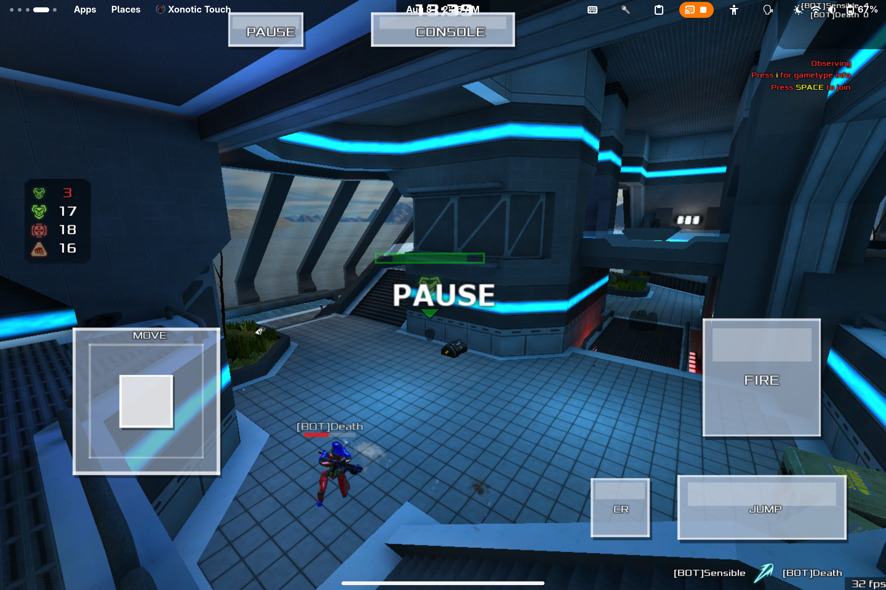
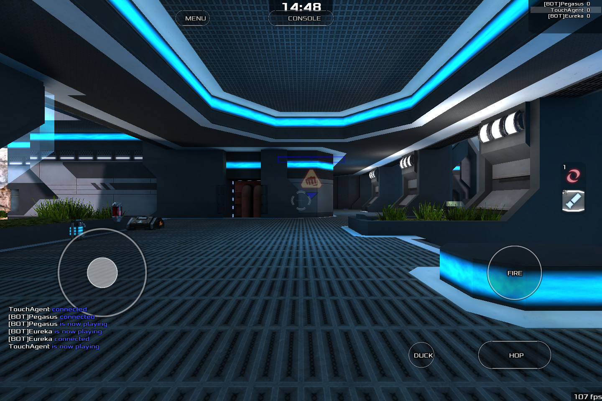

# Touch UX redesign session — 2026-08-08

Target: Surface Pro 9, Ultramarine Linux, touch only, via `gdr --dev=marinesurface`
Spec: [`docs/TOUCH_UX_REDESIGN.md`](../../TOUCH_UX_REDESIGN.md)
Loop: `scripts/dev-deploy.sh --shot NAME`, `scripts/dev-shot.sh NAME`

## Before / after

| Baseline | Redesigned |
|---|---|
|  |  |

Square pale slabs with a light body over light scenery, a box-in-a-box joystick
and an unaligned bottom row, replaced by real discs, capsules and rounded
rectangles from one token set, with MOVE and FIRE on a shared centre line.

## Verified

| Check | Result | Evidence |
|---|---|---|
| Shape masks load | `shape tga`; flat fallback also exercised | [05-debug-readout.jpg](shots/05-debug-readout.jpg) |
| Legible over bright scenery | Dual-stroke rim holds against a white skybox | [02-redesign-bright.jpg](shots/02-redesign-bright.jpg) |
| FIRE physical size | 12.8 mm radius = 25.6 mm across, target 26 mm | `mm/r` in debug readout |
| MOVE / FIRE alignment | Both at `y=0.680` | [01-redesign-ingame.jpg](shots/01-redesign-ingame.jpg) |
| Pressed / latched feedback | Accent fill, glow, latch pip all render | [03-active-states.jpg](shots/03-active-states.jpg) |
| Edit mode | Handles track the finger; hop bar grabbable end to end; toolbar owns the top bar | [04-customize.jpg](shots/04-customize.jpg) |
| Overlay cost | 78 draw calls, 30 fps cap sustained (>110 uncapped) | debug readout |
| Presets | Load from the userdir copy; `cl_maxfps` applies | engine log |
| QC compile | Clean, no new warnings | `make qc` |

## Traps hit, and what they looked like

Each of these produced a *plausible* wrong answer, which is why they are written
down rather than just fixed.

1. **Deploys went nowhere.** `dev-deploy.sh` uploaded to
   `~/.local/share/xonotic-touch/data`, abandoned when the Flatpak build moved
   packs under `~/.var/app/<id>/`. Symptom: code changes with no visible effect.
   Now probes for the directory holding `xonotic-*-data.pk3` and fails loudly.

2. **Configs were being reverted mid-session.** The launcher's
   `sync-bundle-data.sh` restores config files from the bundle, so a preset
   uploaded into the data dir loses a race it looks like it should win. Configs
   now go to `~/.xonotic/data/` (engine userdir, highest priority). Symptom:
   correct-looking code executing a stale file.

3. **Screenshots lied.** `gdr screenshot` returned the loading screen long after
   the map had loaded — a stale compositor buffer for a fullscreen GL surface.
   The evidence said the map never loaded; the game was fine. Captures now come
   from the engine's own `screenshot` (F12) and are pulled from the userdir.

4. **`gdr key` needs numeric evdev keycodes**, not names. `88`, not `F12`.

5. **`fps_max` is not a cvar.** Every performance preset set it; the engine
   created a dud and ran uncapped, so the thermal profile for a fanless tablet
   had no frame cap and had appeared to work since it was written. The name is
   `cl_maxfps` (plus `cl_maxidlefps`).

6. **Two coordinate spaces.** Edit-mode hit-testing used `VF_SIZE` (1920×1280
   surface) while drawing used console space (810×540), so dragged handles
   jumped away from the finger. Everything is console space now.

7. **Multi-touch injection never reached the engine.** `tools/touch-inject.py`
   (uinput virtual touchscreen) produced no input in-game. Rather than keep
   debugging the injector, `touch_debug 3` forces every control into its active
   state so feedback is inspectable in a still frame.

## Not verified

Everything in the input model that depends on concurrent fingers: the hop latch,
fire-drag-look, tap-to-fire in the look zone, and whether the 1€ filter defaults
feel right while aiming. `touch_debug 3` proves these states *render*, not that
they *trigger*. That needs hands on the tablet and is the next task.
